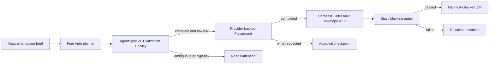

# Agentify

Agentify turns one natural-language brief into a validated, testable agent design and a manifest-checked package produced by HarnessBuilder.

It is a separate application from [HarnessBuilder](https://github.com/RoUchiha/HarnessBuilder), connected through the versioned `AgentSpec v1.1` customization contract inside the `1.0` build-envelope protocol. A complete low-risk request continues automatically through design, a real configured-provider Playground run, HarnessBuilder generation, static verification, and ZIP delivery. Ambiguity, unavailable providers, write approvals, unsupported target settings, and failed gates stop visibly.

> **Live demo:** [agentify-wine.vercel.app](https://agentify-wine.vercel.app)

## What it builds

- OpenAI Agents SDK TypeScript package
- OpenAI Agents SDK Python package
- MCP stdio server
- portable `agent.spec.json`

Every target also includes an immutable harness spec, approval-enforcing gateway, policy and contract tests, adversarial fixtures, CI configuration, file checksums, and a verification report. Tool contracts are generated, but arbitrary real integrations are not invented: generated handlers remain connection-required until an operator supplies an implementation.

## Product flow



Quick Build keeps this as one guided path. Advanced Build exposes the same accepted spec through typed controls, a visual graph, deterministic design advice, and a raw JSON editor; it does not create a second hidden configuration.

## Quick Build and Advanced Build

The persistent mode selector changes the editing surface, not the source of truth. Edits made in either mode update one validated `AgentSpec`, reset stale test/build evidence, and remain present after mode switching.

### Quick Build

Quick Build starts with the natural-language request and asks one focused follow-up at a time when a material decision is missing. Each card shows:

- the exact AgentSpec path that is incomplete;
- why the decision is required and which permissions, privacy, cost, portability, or deployment boundary it affects;
- a ranked easiest recommendation and valid alternatives;
- a safe-default action only when the choice does not grant writes, choose credentials, publish data, select residency, or set retention.

Packaging stays disabled until every blocking decision is resolved. For example, an omitted CRM destination recommends starting read-only; it never invents a CRM credential or authorizes a write.

### Advanced Build

Advanced Build exposes all developer-controlled domains:

1. Overview and decisions
2. Objective plus input/output schemas
3. Agents, roles, instructions, tools, handoffs, and model assignments
4. Models, providers, sampling, reasoning, tool choice, fallback, and timeouts
5. Tool contracts, connections, approvals, retries, concurrency, cache, and credential references
6. Knowledge classification, retention, retrieval, freshness, citations, and failure policy
7. Memory/state schemas, visibility, persistence, redaction, initialization, writers, and conflicts
8. Workflow topology, nodes, edges, retries, loops, checkpoints, and termination
9. Guardrails and approvals
10. Lifecycle hooks
11. Budgets and reliability
12. Runtime, network, filesystem, streaming, and sandbox controls
13. Evaluations and provenance
14. Observability, content capture, redaction, retention, and exporters
15. Delivery contents and package identity
16. Provider/framework overrides
17. The complete raw AgentSpec

Arrays support add, duplicate, reorder, and delete. Optional fields have explicit add/remove controls. Structured changes replace the accepted spec only after full schema and semantic validation.

## Deterministic design advisor

Advanced Build reviews the accepted spec with pure deterministic rules. It detects safety, clarity, reliability, cost, portability, and testing issues such as unredacted persistent state, confidential content tracing, incompatible target overrides, unused tools, excessive budgets, weak schemas, and positive-only evaluation suites.

Advice never mutates the spec automatically. A developer can inspect evidence and impact, preview exact before/after values, explicitly apply a validated patch, navigate to the affected fields, or dismiss the unchanged finding. If the evidence changes, the advice receives a new stable identity and reappears.

## HarnessBuilder compilation matrix

Every AgentSpec build emits a deterministic, secret-free `agent.config.json` plus the immutable harness and verification evidence.

| Target                   | Compiled controls                                                                                                                                                                  | Honest boundary                                                    |
| ------------------------ | ---------------------------------------------------------------------------------------------------------------------------------------------------------------------------------- | ------------------------------------------------------------------ |
| OpenAI Agents TypeScript | primary model/profile settings, Groq/Ollama/OpenAI-compatible provider setup, max turns, workflow name, tracing, environment-reference template, guardrail/hook stubs              | real tool, hook, and guardrail handlers remain connection-required |
| OpenAI Agents Python     | primary model/profile settings, Groq/Ollama/OpenAI-compatible provider setup, max turns, `RunConfig`, workflow name, tracing, environment-reference template, guardrail/hook stubs | real handlers remain connection-required                           |
| MCP server               | stdio or Streamable HTTP transport, declared tool contracts, policy/config evidence, environment references                                                                        | declared tools fail closed until handlers are connected            |
| Portable spec            | the complete validated AgentSpec v1.1 and runtime config without capability loss                                                                                                   | execution is delegated to the consuming runtime                    |

Target-incompatible framework overrides and provider profiles unsupported by a generated runtime fail the blocking `customization-capability` gate. They are never silently ignored.

## Credential references

Agentify accepts only opaque environment-style names such as `GROQ_API_KEY`; it never accepts or serializes credential values. Reference names must match `^[A-Z][A-Z0-9_]{2,79}$`. HarnessBuilder lists required names with blank values in `.env.example`, scans every target file for secret-like material, and blocks delivery on detection.

## Free Auto and data boundaries

Free Auto resolves in this order:

1. a configured local Ollama runner;
2. configured Groq Free Cloud;
3. an explicit connection-required state.

The UI always names the selected boundary. Hybrid is the default; Local and Cloud remain selectable. The hosted demo uses Groq because a public Vercel function cannot call a user’s loopback Ollama server.

## Local development

Requirements: Node.js 22+ and adjacent Agentify/HarnessBuilder checkouts.

Start HarnessBuilder:

```powershell
cd C:\path\to\HarnessBuilder
npm.cmd ci
npm.cmd run dev -- -p 3001
```

Start Agentify in another terminal:

```powershell
cd C:\path\to\Agentify
npm.cmd ci
$env:HARNESS_BUILDER_URL = "http://127.0.0.1:3001"
$env:GROQ_API_KEY = "<server-side value>"
npm.cmd run dev -- -p 3000
```

For local-first planning instead of Groq:

```powershell
$env:OLLAMA_BASE_URL = "http://127.0.0.1:11434"
$env:OLLAMA_MODEL = "qwen3"
```

Environment variables:

| Variable                        | Where                          | Purpose                              |
| ------------------------------- | ------------------------------ | ------------------------------------ |
| `GROQ_API_KEY`                  | Agentify server only           | Groq planning and Playground runs    |
| `OLLAMA_BASE_URL`               | Agentify server only           | paired Ollama HTTP endpoint          |
| `OLLAMA_MODEL`                  | Agentify server only           | eligible local model                 |
| `HARNESS_BUILDER_URL`           | Agentify server only           | versioned build service              |
| `HARNESS_BUILDER_SERVICE_TOKEN` | Agentify server only, optional | service-to-service bearer credential |

No credential is accepted in the browser request, AgentSpec, generated source, report, or ZIP.

## Test lifecycle

Development followed three explicit layers:

- Before and during implementation: each domain, provider, API, UI, and connector behavior was observed failing before production code was added.
- Integrated product: Agentify and HarnessBuilder contract matrices cover every target and execution profile.
- After the full product existed: independent hardening and browser suites were added. Those tests found and permanently cover undeclared workflow references, oversized requests, provider cooldown rendering, ZIP traversal, automatic trace visibility, and route export boundaries.

Run the release gate:

```powershell
npm.cmd test
npm.cmd run test:hardening
npm.cmd run typecheck
npm.cmd run lint
npm.cmd run format:check
npm.cmd run build
npm.cmd audit --omit=dev
npm.cmd run test:e2e
```

The browser suite starts both applications, verifies Quick and Advanced journeys at desktop/tablet/mobile widths with deterministic provider fixtures, and sends a real HTTP build through HarnessBuilder. Live provider behavior is verified separately after the hosted Groq secret is configured.

## What “verified” means

HarnessBuilder performs deterministic static gates over reviewed templates: required files, secret-shaped value scanning, approval policy coverage, customization capability, manifest/checksum consistency, smoke structure, type/lint configuration, and test fixture presence. It does not execute arbitrary generated code inside the web service. Install dependencies and run the generated package's own checks before production use.

See [TRUST_BOUNDARIES.md](./TRUST_BOUNDARIES.md) and [SECURITY.md](./SECURITY.md).

## Research basis

The interaction model was informed by public product documentation, not copied source:

- [Langflow concepts](https://docs.langflow.org/concepts-overview): visual flow plus Playground and export
- [Flowise Agentflow V2](https://docs.flowiseai.com/using-flowise/agentflowv2): explicit state, routing, and human checkpoints
- [AutoGen Studio](https://microsoft.github.io/autogen/stable/user-guide/autogenstudio-user-guide/usage.html): JSON-backed teams, gallery, and Playground
- [Dify application orchestration](https://docs.dify.ai/en/guides/application-orchestrate/creating-an-application): node and full-workflow testing
- [OpenAI Agents SDK](https://openai.github.io/openai-agents-js/guides/agents/): runnable TypeScript target
- [MCP TypeScript SDK v1](https://ts.sdk.modelcontextprotocol.io/server): production-recommended stdio target

## License

No license is granted by default. Add the license appropriate for your release policy before accepting external contributions.
