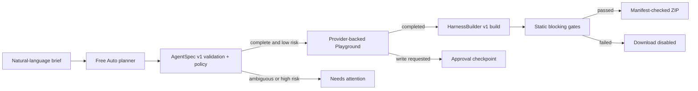

# Agentify

Agentify turns one natural-language brief into a validated, testable agent design and a manifest-checked package produced by HarnessBuilder.

It is a separate application from [HarnessBuilder](https://github.com/RoUchiha/HarnessBuilder), connected through the versioned `AgentSpec v1` contract. A complete low-risk request continues automatically through design, a real configured-provider Playground run, HarnessBuilder generation, static verification, and ZIP delivery. Ambiguity, unavailable providers, write approvals, and failed gates stop visibly.

> Live demo: added during the hosted release after the Groq secret is configured.

## What it builds

- OpenAI Agents SDK TypeScript package
- OpenAI Agents SDK Python package
- MCP stdio server
- portable `agent.spec.json`

Every target also includes an immutable harness spec, approval-enforcing gateway, policy and contract tests, adversarial fixtures, CI configuration, file checksums, and a verification report. Tool contracts are generated, but arbitrary real integrations are not invented: generated handlers remain connection-required until an operator supplies an implementation.

## Product flow



Quick mode keeps this as one guided path. Advanced exposes the same underlying spec as a typed visual graph and JSON editor; it does not create a second hidden configuration.

## Free Auto and data boundaries

Free Auto resolves in this order:

1. a configured local Ollama runner;
2. configured Groq Free Cloud;
3. an explicit connection-required state.

The UI always names the selected boundary. Hybrid is the default; Local and Cloud remain selectable. The hosted demo uses Groq because a public Vercel function cannot call a user’s loopback Ollama server.

## Local development

Requirements: Node.js 22+ and adjacent Agentify/HarnessBuilder checkouts.

Start HarnessBuilder:

```powershell
cd C:\path\to\HarnessBuilder
npm.cmd ci
npm.cmd run dev -- -p 3001
```

Start Agentify in another terminal:

```powershell
cd C:\path\to\Agentify
npm.cmd ci
$env:HARNESS_BUILDER_URL = "http://127.0.0.1:3001"
$env:GROQ_API_KEY = "<server-side value>"
npm.cmd run dev -- -p 3000
```

For local-first planning instead of Groq:

```powershell
$env:OLLAMA_BASE_URL = "http://127.0.0.1:11434"
$env:OLLAMA_MODEL = "qwen3"
```

Environment variables:

| Variable                        | Where                          | Purpose                              |
| ------------------------------- | ------------------------------ | ------------------------------------ |
| `GROQ_API_KEY`                  | Agentify server only           | Groq planning and Playground runs    |
| `OLLAMA_BASE_URL`               | Agentify server only           | paired Ollama HTTP endpoint          |
| `OLLAMA_MODEL`                  | Agentify server only           | eligible local model                 |
| `HARNESS_BUILDER_URL`           | Agentify server only           | versioned build service              |
| `HARNESS_BUILDER_SERVICE_TOKEN` | Agentify server only, optional | service-to-service bearer credential |

No credential is accepted in the browser request, AgentSpec, generated source, report, or ZIP.

## Test lifecycle

Development followed three explicit layers:

- Before and during implementation: each domain, provider, API, UI, and connector behavior was observed failing before production code was added.
- Integrated product: Agentify and HarnessBuilder contract matrices cover every target and execution profile.
- After the full product existed: independent hardening and browser suites were added. Those tests found and permanently cover undeclared workflow references, oversized requests, provider cooldown rendering, ZIP traversal, automatic trace visibility, and route export boundaries.

Run the release gate:

```powershell
npm.cmd test
npm.cmd run test:hardening
npm.cmd run typecheck
npm.cmd run lint
npm.cmd run format:check
npm.cmd run build
npm.cmd audit --omit=dev
npm.cmd run test:e2e
```

The browser suite starts both applications, verifies the one-prompt path with deterministic provider fixtures, and sends a real HTTP build through HarnessBuilder. Live provider behavior is verified separately after the hosted Groq secret is configured.

## What “verified” means

HarnessBuilder performs deterministic static gates over reviewed templates: required files, secret-shaped value scanning, approval policy coverage, manifest/checksum consistency, smoke structure, type/lint configuration, and test fixture presence. It does not execute arbitrary generated code inside the web service. Install dependencies and run the generated package’s own checks before production use.

See [TRUST_BOUNDARIES.md](./TRUST_BOUNDARIES.md) and [SECURITY.md](./SECURITY.md).

## Research basis

The interaction model was informed by public product documentation, not copied source:

- [Langflow concepts](https://docs.langflow.org/concepts-overview): visual flow plus Playground and export
- [Flowise Agentflow V2](https://docs.flowiseai.com/using-flowise/agentflowv2): explicit state, routing, and human checkpoints
- [AutoGen Studio](https://microsoft.github.io/autogen/stable/user-guide/autogenstudio-user-guide/usage.html): JSON-backed teams, gallery, and Playground
- [Dify application orchestration](https://docs.dify.ai/en/guides/application-orchestrate/creating-an-application): node and full-workflow testing
- [OpenAI Agents SDK](https://openai.github.io/openai-agents-js/guides/agents/): runnable TypeScript target
- [MCP TypeScript SDK v1](https://ts.sdk.modelcontextprotocol.io/server): production-recommended stdio target

## License

No license is granted by default. Add the license appropriate for your release policy before accepting external contributions.
